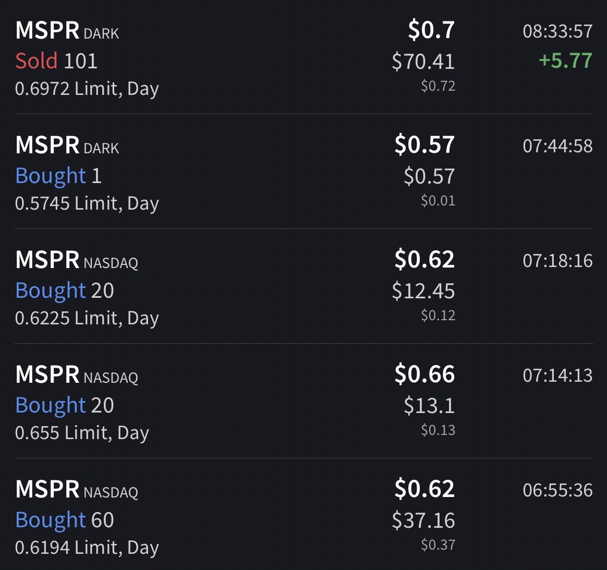
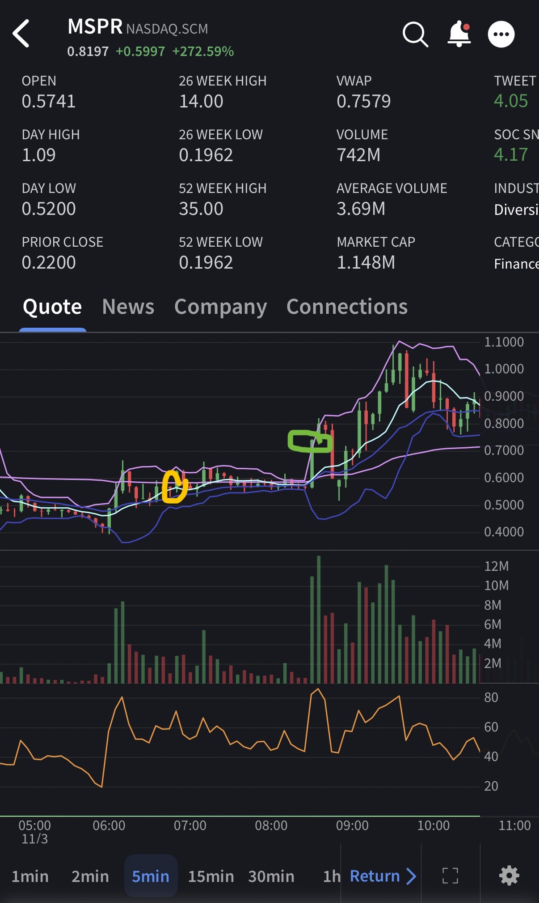

# Trade #1 - MSPR

## Trade Details

- **Ticker**: MSPR
- **Direction**: LONG
- **Entry**: $0.6359 on 2025-11-03 at 06:55
- **Exit**: $0.6972 on 2025-11-03 at 08:34
- **Position Size**: 101 shares
- **Strategy**: VWAP Hold
- **Broker**: IBKR

## Risk Management

- **Stop Loss**: $0.55
- **Target Price**: $.72
- **Risk:Reward Ratio**: 1:0.98

## Results

- **P&L (USD)**: $6.19
- **P&L (%)**: 9.64%

## Notes

Saw this morning runner consolidating on VWAP, got in as it tested VWAP and held.

I should have held longer, and only should have dumped half the position and rode the rest.

## Screenshots

