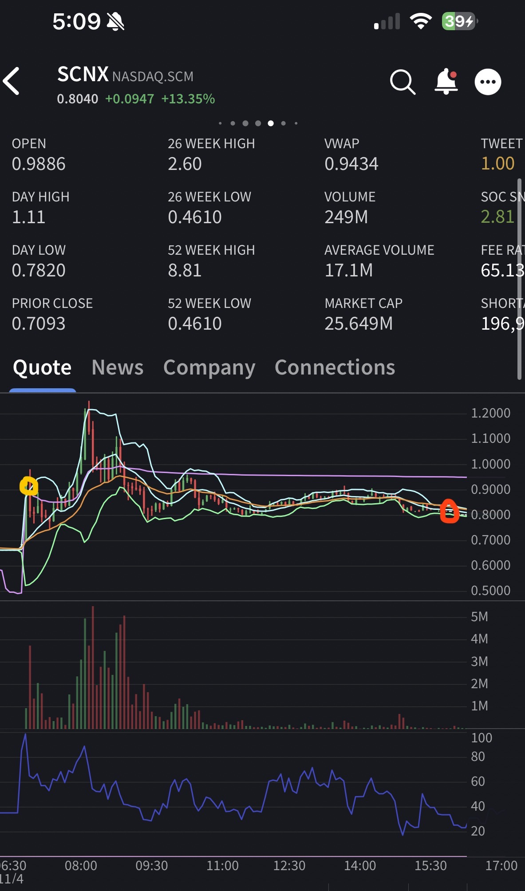
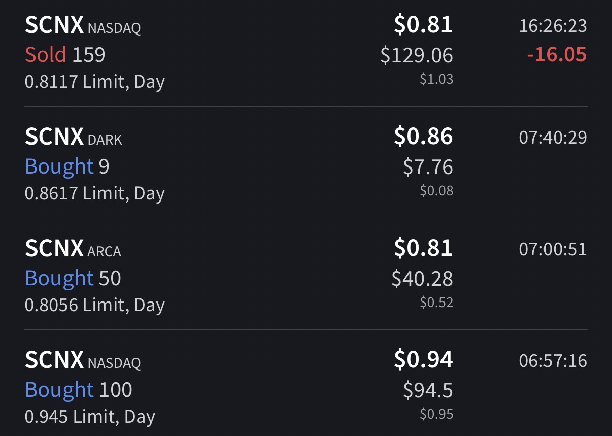

# Trade #1 - SCNX

## Trade Details

- **Ticker**: SCNX
- **Direction**: LONG
- **Entry**: $0.9050 on 2025-11-04 at 06:57
- **Exit**: $0.81 on 2025-11-04 at 16:26
- **Position Size**: 159 shares
- **Strategy**: Breakout Play
- **Broker**: IBKR

## Risk Management

- **Stop Loss**: $0.80
- **Target Price**: $1.30
- **Risk:Reward Ratio**: 1:3.76

## Results

- **P&L (USD)**: $-15.10
- **P&L (%)**: -10.50%

## Notes

Should have sold was sooner, held in Hope of bigger return. It bite back.

## Screenshots

