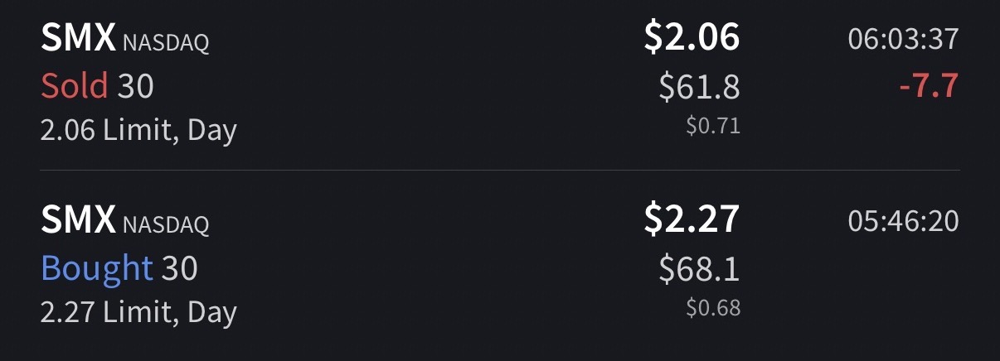

# Trade #1 - SMX

## Trade Details

- **Ticker**: SMX
- **Direction**: LONG
- **Entry**: $2.29 on 2025-11-05 at 05:46
- **Exit**: $2.06 on 2025-11-05 at 06:03
- **Position Size**: 30 shares
- **Strategy**: VWAP Bounce 
- **Broker**: IBKR

## Risk Management

- **Stop Loss**: $2.05
- **Target Price**: $2.80
- **Risk:Reward Ratio**: 1:2.12

## Results

- **P&L (USD)**: $-6.90
- **P&L (%)**: -10.04%

## Notes

Got in with Tim, was skeptical on entering so soon, got bit on stop loss, to watch it run shortly after.

## Screenshots

