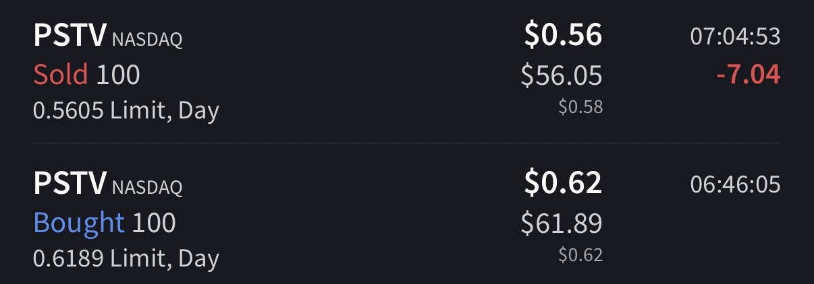

# Trade #1 - PSTV

## Trade Details

- **Ticker**: PSTV
- **Direction**: LONG
- **Entry**: $0.6189 on 2025-11-06 at 07:46
- **Exit**: $0.5605 on 2025-11-06 at 08:04
- **Position Size**: 100 shares
- **Strategy**: Breakout
- **Broker**: IBKR

## Risk Management

- **Stop Loss**: $.5
- **Target Price**: $1
- **Risk:Reward Ratio**: 1:3.21

## Results

- **P&L (USD)**: $-5.84
- **P&L (%)**: -9.44%

## Notes

Properly Got in to a 10% runner, failed to sale in time, ended up holding the bag.

## Screenshots

