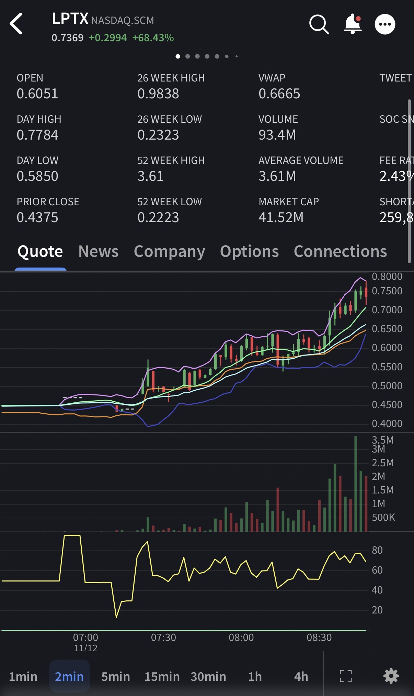
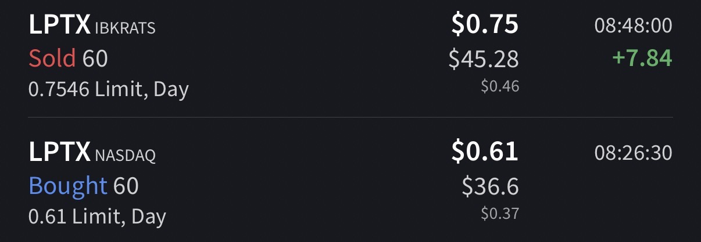

# Trade #1 - LPTX

## Trade Details

- **Ticker**: LPTX
- **Direction**: LONG
- **Entry**: $0.6164 on 2025-11-12 at 08:26
- **Exit**: $0.7546 on 2025-11-12 at 08:48
- **Position Size**: 60 shares
- **Strategy**: Breakout
- **Broker**: IBKR

## Risk Management

- **Stop Loss**: $0.55
- **Target Price**: $0.75
- **Risk:Reward Ratio**: 1:2.01

## Results

- **P&L (USD)**: $8.29
- **P&L (%)**: 22.42%

## Notes

Saw this morning runner eat all of its short-able shares and not drop, so I got in and rode my ~10-20% and got out. Great play, could have held longer.

## Screenshots

