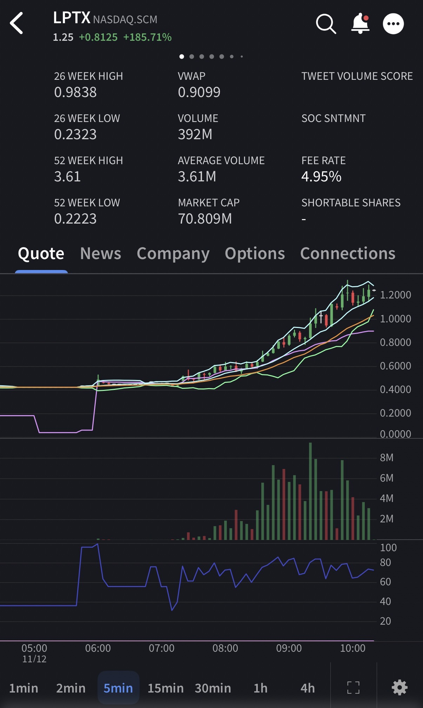
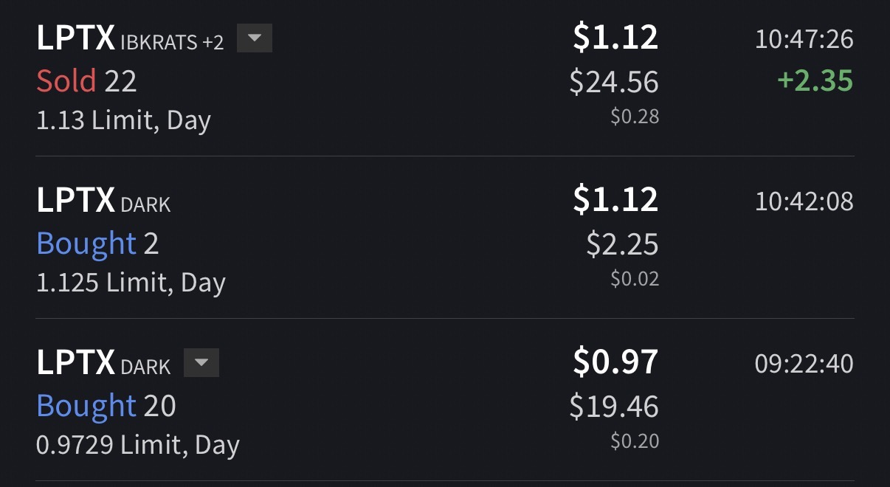

# Trade #2 - LPTX

## Trade Details

- **Ticker**: LPTX
- **Direction**: LONG
- **Entry**: $0.9845 on 2025-11-12 at 09:22
- **Exit**: $1.13 on 2025-11-12 at 10:47
- **Position Size**: 22 shares
- **Strategy**: Continuation
- **Broker**: IBKR

## Risk Management

- **Stop Loss**: $0.95
- **Target Price**: $1.20
- **Risk:Reward Ratio**: 1:6.25

## Results

- **P&L (USD)**: $3.20
- **P&L (%)**: 14.78%

## Notes

Got into this winner from the morning session, Got out in a rough patch, was a test trade for a strategy idea, turned out good.

## Screenshots

